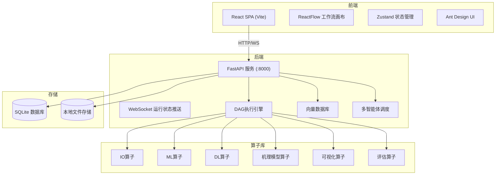

# AI模型训练编排平台 — 用户使用说明

> **版本**: 0.2.0
> **技术栈**: FastAPI + React + SQLite + scikit-learn + XGBoost
> **定位**: Web平台级AI模型训练编排系统

---

## 目录

1. [平台概述](#1-平台概述)
2. [快速开始](#2-快速开始)
3. [系统架构](#3-系统架构)
4. [前端导航与页面](#4-前端导航与页面)
5. [核心功能详解](#5-核心功能详解)
6. [算子参考](#6-算子参考)
7. [API参考](#7-api参考)
8. [自动化测试](#8-自动化测试)
9. [常见问题](#9-常见问题)

---

## 1. 平台概述

AI模型训练编排平台定位为专属AI模型 **"智造工厂"**，提供覆盖数据管理、可视化工作流编排、模型训练、知识库、多智能体协同的全链路AI开发能力。

### 1.1 核心能力

| 能力模块 | 说明 |
|---------|------|
| **自动化建模** | 面向点焊工艺场景，支持数据导入→特征工程→模型选择→超参配置的自动化流程 |
| **模型训练** | 统一训练框架，支持XGBoost/Random Forest/LR/Sklearn/MLP等模型 |
| **可视化工作流** | 拖拽式DAG画布编排，支持条件分支、循环、并行执行 |
| **多智能体协同** | 大小模型协同调度，任务分解→分配→结果聚合 |
| **向量数据库** | HNSW近似索引，支持余弦/欧式/点积距离，元数据过滤和混合检索 |
| **RAG知识库** | 基于向量数据库的检索增强生成，文档导入→切片→向量化→检索全流程 |
| **资源监控** | 实时采集CPU/GPU/内存/磁盘指标，历史趋势查看 |

### 1.2 目标用户

- **业务人员** — 零代码拖拽编排工作流
- **产线人员** — 使用预置模板快速推理
- **算法工程师** — 模型训练、参数调优、评估对比

---

## 2. 快速开始

详细部署文档：

- Windows：`docs/delivery/WINDOWS_DEPLOYMENT.md`
- Ubuntu：`docs/delivery/UBUNTU_DEPLOYMENT.md`
- 用户操作：`docs/delivery/USER_GUIDE.md`
- 焊接演示：`docs/delivery/DEMO_GUIDE.md`

### 2.1 环境要求

- Python 3.10+
- Node.js 18+
- npm 9+

### 2.2 安装依赖

```bash
# 后端
cd ml-platform/backend
pip install -r requirements.txt

# 前端
cd ml-platform/frontend
npm install
```

### 2.3 启动服务

```bash
# 方式一：一键启动（Windows）
cd ml-platform
start.bat

# Ubuntu
chmod +x scripts/*.sh
./scripts/start.sh

# 方式二：分别启动
# 终端1 - 后端 (http://localhost:8000)
cd ml-platform/backend
uvicorn app.main:app --host 127.0.0.1 --port 8000 --reload

# 终端2 - 前端 (http://localhost:5173)
cd ml-platform/frontend
npm run dev
```

### 2.4 默认登录

启动后访问 **http://localhost:5173**

| 用户名 | 密码 | 角色 |
|--------|------|------|
| admin | admin123 | 管理员 |

系统首次启动时自动创建admin用户。

---

## 3. 系统架构

### 3.1 整体架构



### 3.2 后端API路由一览

默认账号admin/admin123。启动后访问 **http://localhost:8000/docs** 查看Swagger交互式文档。

| 前缀 | 模块 | 需要认证 |
|------|------|---------|
| `/api/auth` | 登录/注册 | 部分公开 |
| `/api/projects` | 项目管理 | 是 |
| `/api/workflows` | 工作流执行 | 是 |
| `/api/operators` | 算子列表 | 否 |
| `/api/datasets` | 数据集管理 | 是 |
| `/api/training` | 模型训练 | 是 |
| `/api/model-library` | 模型库 | 是 |
| `/api/knowledge` | 知识库/RAG | 是 |
| `/api/orchestration` | 多智能体 | 是 |
| `/api/monitor` | 资源监控 | 是 |
| `/api/compute` | 计算节点 | 是 |
| `/api/chat` | AI对话 | 部分公开 |
| `/api/dashboard` | 数据驾驶舱 | 否 |
| `/api/algorithms` | 算法目录 | 否 |
| `/api/labeling` | 自动标注 | 否 |
| `/api/platform` | API市场 | 是 |

---

## 4. 前端导航与页面

### 4.1 页面路由表

| 路径 | 页面 | 功能 |
|------|------|------|
| `/login` | 登录 | 用户登录 |
| `/register` | 注册 | 新用户注册 |
| `/` | 数据驾驶舱 | 平台核心指标总览 |
| `/projects` | 项目管理 | 项目列表、创建、删除 |
| `/projects/:id` | 项目详情 | 项目内工作流管理 |
| `/workspace/:wfId` | 工作流画布 | 拖拽编排核心界面 |
| `/models` | 模型库 | 训练完成的模型管理 |
| `/data` | 数据管理 | 数据集上传/查看/导出 |
| `/training` | 训练任务 | 训练任务列表与状态 |
| `/automl` | 自动建模 | 自动化特征工程+模型选择 |
| `/knowledge` | 知识库 | RAG知识库管理 |
| `/knowledge/:kbId` | 知识详情 | 文档/向量/图 |
| `/knowledge-graph` | 知识图谱 | 实体关系可视化 |
| `/algorithms` | 算法目录 | 内置70+算法查看 |
| `/api-marketplace` | API市场 | 模型API管理 |
| `/annotations` | 标注工具 | 规则/相似度标注 |
| `/orchestration` | 智能体编排 | 多智能体协同 |
| `/compute` | 计算资源 | 节点/边缘设备管理 |
| `/monitor` | 监控面板 | CPU/GPU/内存/磁盘 |
| `/chat` | AI智能对话 | LLM智能问答 |
| `/admin/users` | 用户管理 | 用户列表、角色管理 |

### 4.2 工作流画布核心功能

工作流画布 (`/workspace/:id`) 是平台的 **核心操作界面**，提供：

- **算子面板** — 左侧列出所有可用算子，按类别分组
- **拖拽放置** — 从算子面板拖拽到画布指定位置
- **连线连接** — 从输出端口拖出连线到输入端口
- **参数配置** — 选中节点后右侧面板显示参数
- **执行按钮** — 运行整个工作流，实时推送状态
- **保存按钮** — 保存当前画布状态
- **节点状态颜色** — 橙色(待运行) / 绿色(成功) / 红色(失败)

---

## 5. 核心功能详解

### 5.1 项目管理

进入 `/projects` 可创建项目。每个项目包含多个工作流。

```bash
# API方式创建
curl -X POST "http://localhost:8000/api/projects" \
  -H "Authorization: Bearer <token>" \
  -H "Content-Type: application/json" \
  -d '{"name": "焊接质量预测", "description": "点焊质量预测项目"}'
```

### 5.2 工作流编排

1. 在项目详情页点击"新建工作流"
2. 进入画布后从左侧算子面板拖拽算子到画布
3. 连线连接算子的输入输出端口
4. 选中节点并在右侧面板配置参数
5. 点击"保存" → "运行"

**示例：分类工作流**

```
[CSV/Excel导入] → [数据缩放] → [训练/测试拆分] → [XGBoost训练] → [分类评估]
```

**示例：含条件分支**

```
[CSV导入] → [条件判断(quality>0.8)] → 是→[模型部署] / 否→[重新训练]
```

### 5.3 模型训练

通过训练任务页面或工作流中的训练算子触发：

```bash
curl -X POST "http://localhost:8000/api/training/run" \
  -H "Authorization: Bearer <token>" \
  -H "Content-Type: application/json" \
  -d '{
    "project_id": "<project-id>",
    "name": "xgboost_weld",
    "operator_id": "xgboost_train",
    "params": {"n_estimators": 100, "max_depth": 6}
  }'
```

支持：
- 超参数自动调优
- 早停策略（patience/min_delta/monitor）
- 模型检查点管理
- 增量训练、版本管理

### 5.4 知识库与RAG

知识库支持文档导入→切片→向量化→检索全流程：

1. 在 `/knowledge` 创建知识库
2. 上传文档内容
3. 切片并向量化（调用向量数据库）
4. 基于语义搜索检索相关知识
5. 配合AI对话模块实现RAG问答

支持知识图谱实体-关系管理。

### 5.5 多智能体协同

编排引擎可实现大小模型协同：

- **planner** — 任务规划（LLM驱动）
- **executor** — 专业计算（小模型/机理算子）
- **reviewer** — 结果审核
- **llm** — 自然语言理解

任务分解→分配→结果聚合→人工审核决策点。

### 5.6 资源监控

实时查看CPU/GPU/内存/磁盘占用：

```bash
# 当前指标
curl "http://localhost:8000/api/monitor/current"

# 历史记录
curl "http://localhost:8000/api/monitor/history?limit=60"
```

---

## 6. 算子参考

### 6.1 数据IO

| 算子ID | 名称 | 说明 |
|--------|------|------|
| `csv_import` | CSV/Excel导入 | 支持CSV/XLSX文件或URL路径 |
| `csv_export` | CSV导出 | 导出处理结果到CSV |
| `image_import` | 图片导入 | 读取图片文件 |
| `json_import` | JSON导入 | 读取JSON数据 |

### 6.2 数据处理

| 算子ID | 名称 | 说明 |
|--------|------|------|
| `scaler` | 数据缩放 | Standard/MinMax/Robust标准化 |
| `train_test_split` | 训练/测试拆分 | 按比例拆分数据集 |
| `label_encoder` | 标签编码 | 类别特征数值化 |
| `missing_value_handler` | 缺失值处理 | 填充/删除缺失值 |
| `auto_feature_engineering` | 自动特征工程 | 自动化特征生成与选择 |

### 6.3 机器学习

| 算子ID | 名称 | 说明 |
|--------|------|------|
| `xgboost_train` | XGBoost训练 | 梯度提升树，支持分类/回归 |
| `random_forest_train` | 随机森林训练 | 集成学习分类/回归 |
| `linear_model_train` | 线性模型训练 | 线性回归/逻辑回归 |
| `kmeans` | KMeans聚类 | 无监督聚类 |

### 6.4 深度学习

| 算子ID | 名称 | 说明 |
|--------|------|------|
| `mlp_classifier` | MLP分类器 | 多层感知机分类 |
| `mlp_regressor` | MLP回归 | 多层感知机回归 |
| `cnn1d_classifier` | CNN1D分类器 | 一维卷积分类 |

### 6.5 点焊机理模型

| 算子ID | 名称 | 说明 |
|--------|------|------|
| `mechanism_thermal` | 热传导 | Fourier导热+有限差分法计算温度场 |
| `mechanism_nugget` | 熔核生长 | 焦耳热方程预测熔核直径/熔深 |
| `mechanism_lobe` | 焊接窗口 | 确定可焊参数上下限 |
| `mechanism_splash` | 飞溅预测 | 预测飞溅发生概率 |
| `mechanism_stress` | 残余应力 | 热弹塑性简化模型 |
| `mechanism_gate` | 综合审核 | 5个模型综合判定 |

### 6.6 评估

| 算子ID | 名称 | 说明 |
|--------|------|------|
| `classification_eval` | 分类评估 | 准确率/精确率/召回率/F1 |
| `classification_eval_detailed` | 分类评估(详细) | 混淆矩阵/分类报告 |
| `regression_eval` | 回归评估 | MSE/MAE/R² |
| `model_comparison` | 模型对比 | 多模型性能对比 |

### 6.7 可视化

| 算子ID | 名称 | 说明 |
|--------|------|------|
| `data_table` | 数据表格 | 表格预览 |
| `data_stats` | 数据统计 | 描述性统计 |
| `roc_curve` | ROC曲线 | 二分类ROC曲线 |
| `feature_importance` | 特征重要性 | 特征重要性排序图 |
| `distribution_plot` | 分布图 | 数据分布直方图 |

### 6.8 控制流

| 算子ID | 名称 | 说明 |
|--------|------|------|
| `condition` | 条件分支 | if/else流程控制 |
| `merge` | 合并 | 分支汇合 |
| `loop` | 循环 | 迭代执行子图 |

---

## 7. API参考

### 7.1 认证

```bash
# 登录获取令牌
curl -X POST "http://localhost:8000/api/auth/login" \
  -d "username=admin&password=admin123"

# 注册新用户
curl -X POST "http://localhost:8000/api/auth/register" \
  -H "Content-Type: application/json" \
  -d '{"username":"engineer1","password":"pass123","role":"engineer"}'
```

### 7.2 核心API

| 方法 | 路径 | 说明 |
|------|------|------|
| GET | `/api/health` | 健康检查 |
| GET | `/api/operators` | 获取所有算子列表 |
| GET/POST | `/api/projects` | 项目列表/创建 |
| GET/PUT/DELETE | `/api/projects/{id}` | 项目详情/更新/删除 |
| GET/POST | `/api/projects/{pid}/workflows` | 工作流列表/创建 |
| GET/PUT/DELETE | `/api/projects/{pid}/workflows/{wid}` | 工作流详情/保存/删除 |
| POST | `/api/workflows/{wid}/run` | 运行工作流 |
| GET | `/api/runs/{rid}` | 查看运行状态 |
| POST | `/api/projects/{pid}/datasets/upload` | 上传数据集 |
| GET | `/api/datasets/{did}/preview` | 预览数据集 |
| GET | `/api/dashboard/stats` | 平台统计 |
| GET | `/api/monitor/current` | 当前资源监控 |
| GET | `/api/monitor/history` | 历史监控数据 |
| POST | `/api/chat` | AI对话 |
| GET/POST | `/api/model-library` | 模型库列表/创建 |
| GET/POST | `/api/knowledge/bases` | 知识库列表/创建 |
| GET/POST | `/api/orchestration/agents` | 智能体管理 |
| GET/POST | `/api/compute/nodes` | 计算节点管理 |
| GET/POST | `/api/labeling/rules` | 规则标注 |
| GET/POST | `/api/algorithms` | 算法目录 |

详情见 [http://localhost:8000/docs](http://localhost:8000/docs) (Swagger UI)

---

## 8. 自动化测试

### 8.1 后端测试

标准后端 runner 当前执行 **31 个隔离测试模块**，每个模块使用独立临时 SQLite 数据库。

```bash
cd ml-platform/backend

# 运行标准套件
python run_suite.py

# 运行指定模块
python -m unittest tests.test_api_projects -v
python -m unittest tests.test_engine_vector_store -v
python -m unittest tests.test_operators_mechanism -v
```

### 8.2 测试模块清单

| 测试文件 | 用例数 | 类型 |
|---------|--------|------|
| `test_app.py` | 4 | 健康/配置/模型关系 |
| `test_dag.py` | 13 | DAG验证/Registry/DataBus |
| `test_engine_advanced.py` | 30 | DAG错误处理/循环/条件 |
| `test_operators_extended.py` | 25 | 全部算子存在性验证 |
| `test_operators_mechanism.py` | 8 | 6个机理模型执行 |
| `test_engine_vector_store.py` | 11 | 向量增删查/持久化 |
| `test_engine_orchestrator.py` | 10 | 多智能体调度/审核 |
| `test_api_projects.py` | 12 | 项目CRUD |
| `test_api_workflows.py` | 10 | 工作流CRUD/保存 |
| `test_api_datasets.py` | 8 | 数据集上传/预览/导出 |
| `test_api_users.py` | 10 | 登录/注册/鉴权 |
| `test_api_runs.py` | 4 | 工作流执行 |
| `test_api_model_library.py` | 12 | 模型CRUD/统计 |
| `test_api_monitor.py` | 9 | 资源监控 |
| `test_api_chat.py` | 7 | AI对话 |
| `test_api_compute.py` | 15 | 计算节点/设备 |
| `test_api_algorithm.py` | 6 | 算法目录 |
| `test_api_dashboard.py` | 5 | 仪表盘统计 |
| `test_api_labeling.py` | 8 | 规则标注 |
| `test_api_platform.py` | 5 | API市场 |
| `test_training.py` | 3 | 训练任务/早停 |
| `test_agents.py` | 8 | 智能体API |
| `test_knowledge.py` | 7 | 知识库/RAG/图谱 |

### 8.3 前端测试

```bash
cd ml-platform/frontend
npm install
npm test
```

当前包含 11 个测试文件、30 个测试，覆盖 API 适配器、工作流状态、布局、算子参数与端口预览本地化、训练和 Artifact 模板向导。

### 8.4 浏览器验收

```bash
cd ml-platform/frontend
npx playwright install chromium
npx playwright test --project=chromium
```

主流程覆盖登录、创建项目、上传焊接数据、实例化模板、运行工作流和读取 metrics。

---

## 9. 常见问题

### Q: 启动后无法登录？

确保后端已启动。默认账号 admin / admin123。系统首次运行时自动创建。

### Q: 数据库在哪？

SQLite文件位于 `ml-platform/backend/ml_platform.db`。如需重置，删除该文件后重启服务即可。

### Q: 如何添加新算子？

1. 在 `backend/app/operators/` 下创建算子模块
2. 继承 `BaseOperator`，实现 `validate()` 和 `execute()` 方法
3. 算子ID不能重复，系统自动注册
4. 在 `main.py` 中添加 `import` 语句

### Q: 工作流运行失败怎么办？

1. 检查算子参数是否完整（选中节点在右侧面板查看）
2. CSV导入需要文件路径正确
3. 检查工作流是否有断开的连线
4. 在后端日志中查看具体错误信息

### Q: 知识库搜索不准？

1. 检查文档是否正确切片和向量化
2. 调整 `chunk_size` 参数
3. 确认向量检索的 `top_k` 参数
4. 可以使用元数据过滤提高精确度

### Q: LLM对话不可用？

API需要配置环境变量 `LLM_API_KEY`。对话接口返回"LLM not configured"时说明未配置。

### Q: 如何查看系统资源占用？

访问 `/monitor` 页面或调用 `/api/monitor/current` 查看实时CPU/GPU/内存/磁盘数据。

### Q: 机理模型需要什么参数？

| 参数 | 说明 | 默认值 |
|------|------|--------|
| `current_ka` | 焊接电流 (kA) | 10.0 |
| `weld_time_ms` | 焊接时间 (ms) | 200 |
| `electrode_force_kn` | 电极压力 (kN) | 3.0 |
| `sheet_thickness_mm` | 板厚 (mm) | 1.5 |
| `material_code` | 材料代号 | DC04 |
| `voltage_v` | 电压 (V) | 1.5 |

### Q: 测试覆盖率如何？

后端标准 runner 当前 45/45 模块通过，第五周入口为 12/12。运行 `python run_suite.py` 或 `python run_suite.py --week 5` 查看逐模块结果。

### Q: 如何启动生产基础设施？

在仓库根目录设置生产数据库、JWT、Redis 和 MinIO 环境变量后，运行 `docker compose up -d postgres redis minio minio-init migrate backend worker`。`migrate` 成功退出后 API 和 Worker 才会启动；使用 `/api/health` 检查进程，使用 `/api/ready` 检查 PostgreSQL/Alembic、Redis、Celery 和 MinIO。迁移、回滚和错误码见 `docs/delivery/PRODUCTION_INFRASTRUCTURE.md`。

---

> **文档版本**: 0.3.0 | **最后更新**: 2026-07-17
> **问题反馈**: 提交Issue或联系平台管理员
